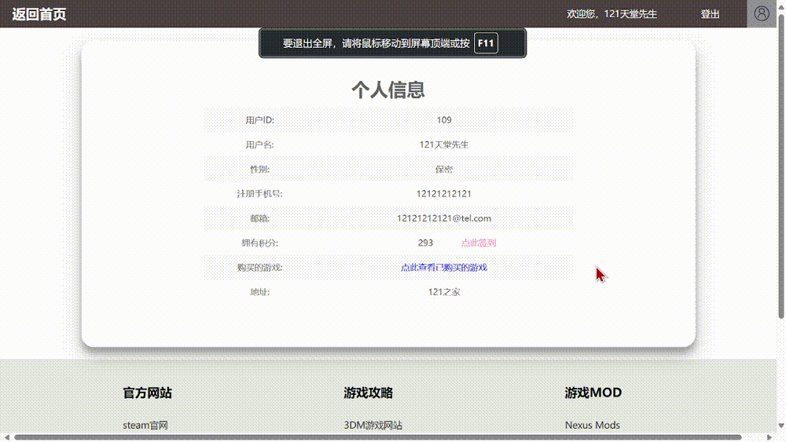
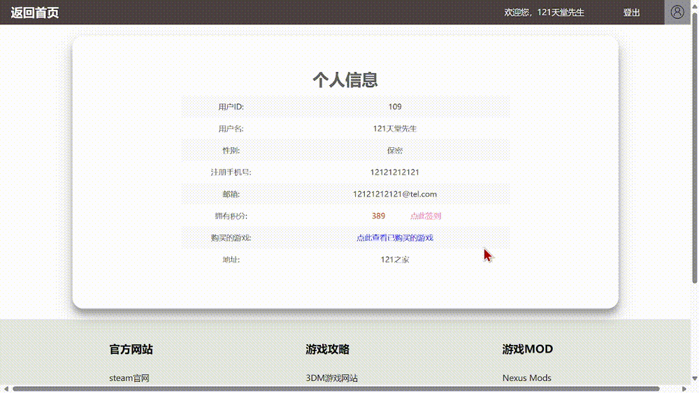
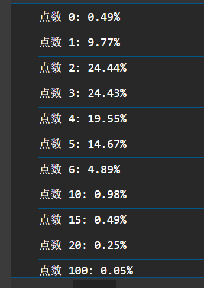
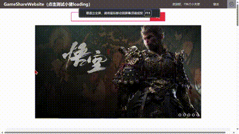
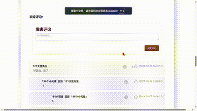

# GameShareWebsite
## ———— 一个简单的大学课程设计Web项目

<strong style="color:#009999">（ 注：readme.md于24年8月2日开始更新。）</strong>

 
 
 
 
 
 

### 更新日志
- **更新日期**：2024年8月13日
- **更新内容**：
  - 修好了轮播图显示异常的bug。
  - 增加了点击指定图片跳转的功能。

##### 轮播图模块演示如下：

 
 
 
 
 
 

### 更新日志
- **更新日期**：2024年8月11日
- **更新内容**：
  - 新增签到功能。
  - 增加了弹窗处理。
  - 引入了tld自定义标签和函数功能。

##### 未限制前的签到演示如下：

##### 限制后的签到演示如下：

##### 签到获得的积分各数量的大约概率如下：

 
 
 
 
 
 

### 更新日志
- **更新日期**：2024年8月9日
- **更新内容**：
  - 修剪了部分网页的html结构。
  - 嵌入了小猪loading加载动画。

##### 小猪loading示例如下：

### 更新日志
- **更新日期**：2024年8月8日
- **更新内容**：
  - 完善了评论功能的全部内容，包括游戏评论、评论点赞、评论回复。
  - 优化了评论区的排版和显示。

##### 评论功能演示：

 
 
 
 
 
 

### 更新日志
- **更新日期**：2024年8月2日
- **更新内容**：
  - 优化了评论区的排版方式，尽管仍需进一步改进。
  - 排版规律为：一级评论按点赞量高低排序，多级评论同级间有相同缩进且始终按时间先后顺序排序。
  - 剩余功能正在完善中。

##### 优化后的评论区排版示例：

**注意**：以上内容仅为示例，具体细节和功能应参照实际项目情况。