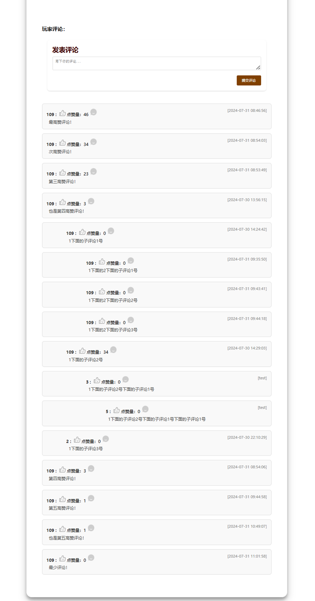
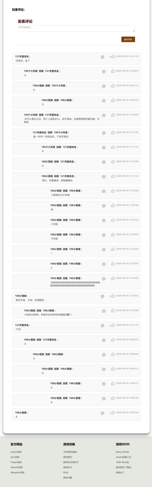

# GameShareWebsite
## 一个简单的大学课程设计Web项目

##- 注：readme.md于24年8月2日开始更新。

### 更新日志
- **更新日期**：2024年8月2日
- **更新内容**：
  - 优化了评论区的排版方式，尽管仍需进一步改进。
  - 排版规律为：一级评论按点赞量高低排序，多级评论同级间有相同缩进且始终按时间先后顺序排序。
  - 剩余功能正在完善中。

### 优化后的评论区排版示例
以下是优化后的层级评论排版示意图：

### 更新日志
- **更新日期**：2024年8月8日
- **更新内容**：
  - 完善了评论功能的全部内容，包括游戏评论、评论点赞、评论回复。
  - 优化了评论区的排版和显示。

### 优化后的评论区排版示例
以下是优化后的评论区排版示意图：

**注意**：以上内容仅为示例，具体细节和功能应根据实际项目情况进行填充和调整。