# GameShareWebsite
## ———— 一个简单的大学课程设计Web项目

<strong style="color:#009999">（ 注：readme.md于24年8月2日开始更新。）</strong>

     
> ### 更新日志
- **更新日期**：2024年12月04日
- **更新内容**：
  - 数据库新增表sign_in。更新后附在 根目录/storage/sql下。
  - 完成了签到功能。每日可签到一次，获得不同权重下的积分。
##### 跑1000万次循环的实机测试概率图如下：
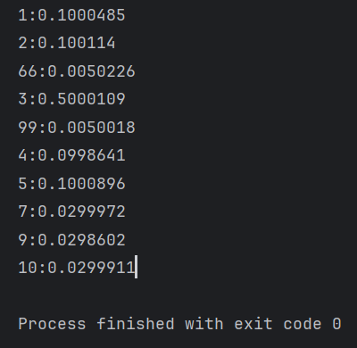

##### 签到演示如下：
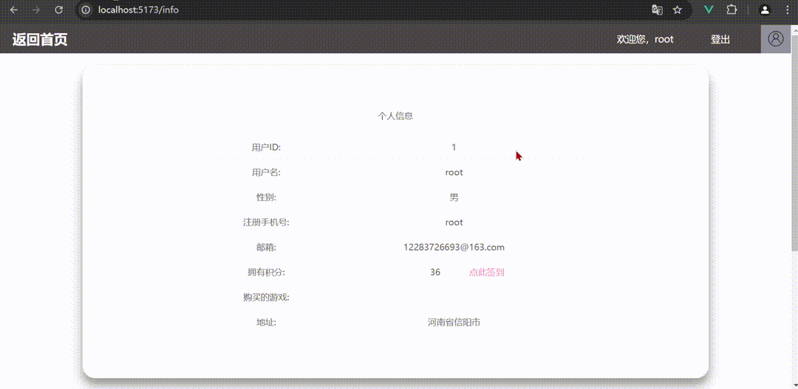

     
> ### 更新日志
- **更新日期**：2024年11月30日
- **更新内容**：
  - #### !! 此次更新了数据库SQL文件。位于 根目录/storage/sql中。
  - 写好了评论回复功能。用户现在可以对任一合法评论进行回复，回复实时显示；对于已被删除的评论（这类评论标记为删除，但仍保留数据，且评论区不显示原评论内容），其点赞和评论图标变灰且不可点击。
  - 稍微规范了Feedback页的代码。
##### 演示如下：
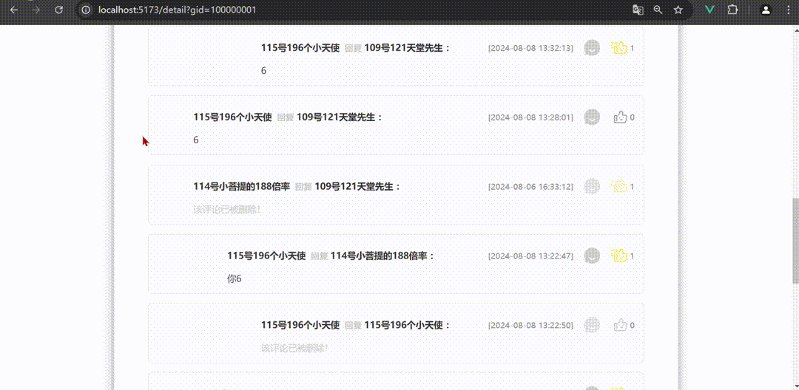

     
> ### 更新日志
- **更新日期**：2024年11月29日
- **更新内容**：
  - 写好了评论功能。用户现在可以发表一级评论；评论回复功能尚未完成。具体细节为：
  1，修改了game_comment表的表结构。最终持久层的字段数为9个，供给前端的字段数为12个；主要的修改是：cpath字段由持久层字段改为了临时字段，由查询SQL临时生成。
  2，多出的字段属CTE（Common Table Expressions，公用表表达式，是用于递归查询的SQL表达式）生成的临时字段，用于前端页面显示等。
##### 演示如下：
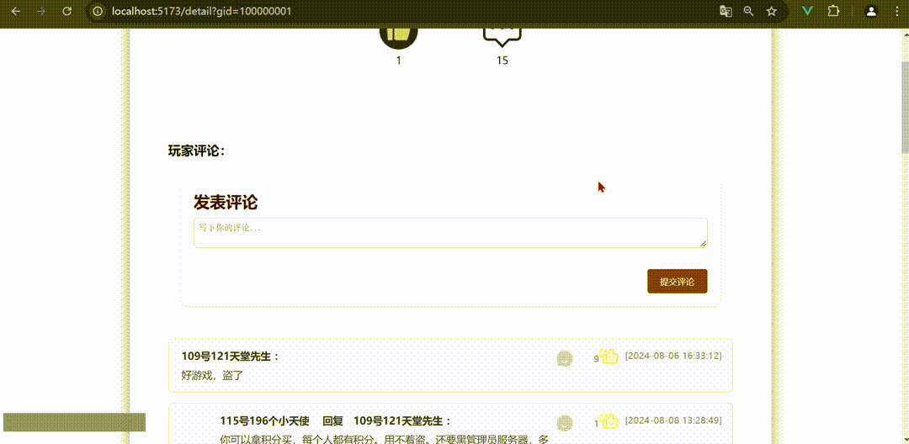

     
> ### 更新日志
- **更新日期**：2024年11月24日
- **更新内容**：
  - 写好了评论点赞功能。具体细节为：
  1，给某一评论点赞，会实时显示赞数和亮灭图标的变化；
  2，用户评论点赞记录持久化记忆。用户进入某一游戏页面后，缓存中会存有过去的评论点赞数据，由此会正确显示评论点赞情况，即点赞图标的亮灭。
##### 演示如下：

     
> ### 更新日志
- **更新日期**：2024年11月22日
- **更新内容**：
  - 新增springdoc文档，并配置了可以在文档页的请求发送时，携带jwt于header中。
  - 依赖结构变换为DependencyManagement的风格，统一管理子模块依赖版本。
##### springdoc文档页演示如下：
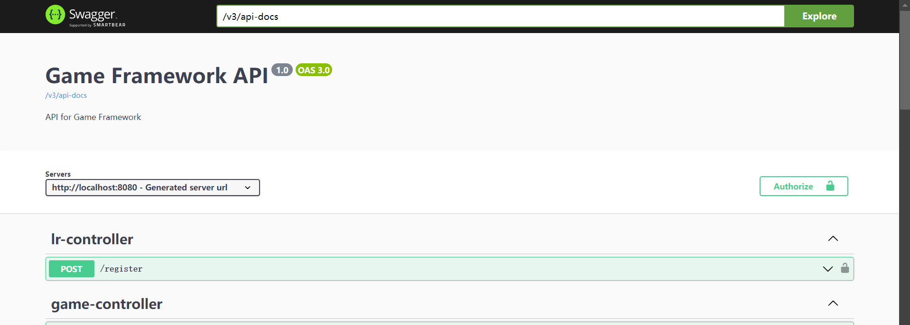

     
> ### 更新日志
- **更新日期**：2024年11月19日
- **更新内容**：
  - 项目结构变换为Spring boot + Vue。翻新了部分代码。
  - detail页游戏评论区新增分页功能。前端使用element-plus的分页组件，后端使用MyBatisPlus的Page插件。
##### 评论区分页模块演示如下：
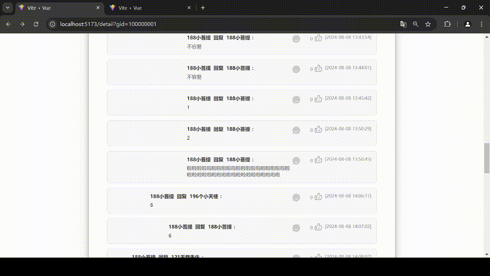

     
> ### 更新日志
- **更新日期**：2024年8月13日
- **更新内容**：
  - 修好了轮播图显示异常的bug。
  - 增加了点击指定图片跳转的功能。
##### 轮播图模块演示如下：

     
>### 更新日志
- **更新日期**：2024年8月11日
- **更新内容**：
  - 新增签到功能。
  - 增加了弹窗处理。
  - 引入了tld自定义标签和函数功能。
##### 未限制前的签到演示如下：
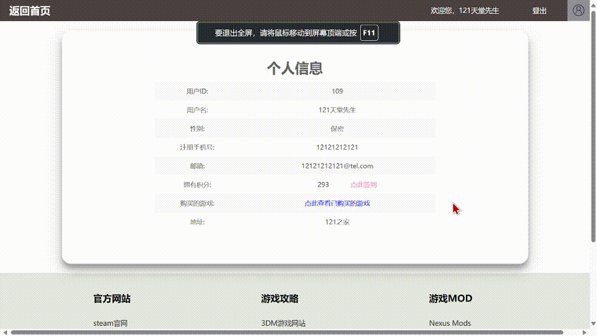

##### 限制后的签到演示如下：
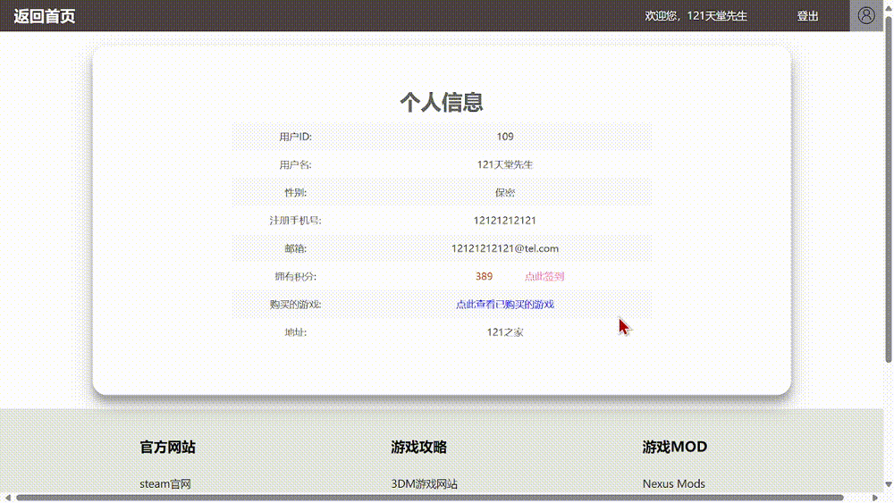

##### 签到获得的积分各数量的大约概率如下：
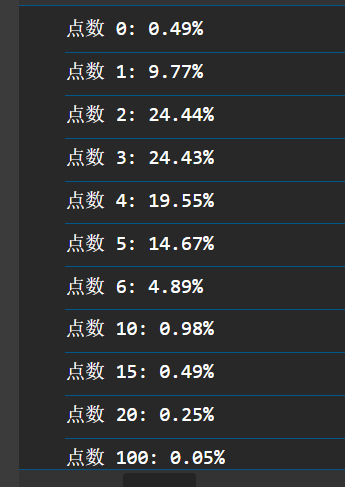

     
>### 更新日志
- **更新日期**：2024年8月9日
- **更新内容**：
  - 修剪了部分网页的html结构。
  - 嵌入了小猪loading加载动画。
##### 小猪loading示例如下：
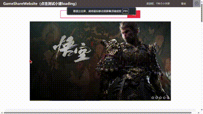

     
>### 更新日志
- **更新日期**：2024年8月8日
- **更新内容**：
  - 完善了评论功能的全部内容，包括游戏评论、评论点赞、评论回复。
  - 优化了评论区的排版和显示。
##### 评论功能演示：
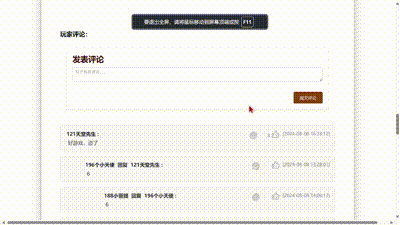

     
>### 更新日志
- **更新日期**：2024年8月2日
- **更新内容**：
  - 优化了评论区的排版方式，尽管仍需进一步改进。
  - 排版规律为：一级评论按点赞量高低排序，多级评论同级间有相同缩进且始终按时间先后顺序排序。
  - 剩余功能正在完善中。
##### 优化后的评论区排版示例：
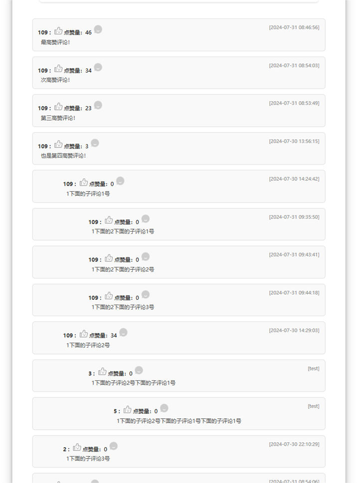

     
**注意**：以上内容仅为示例，具体细节和功能应参照实际项目情况。